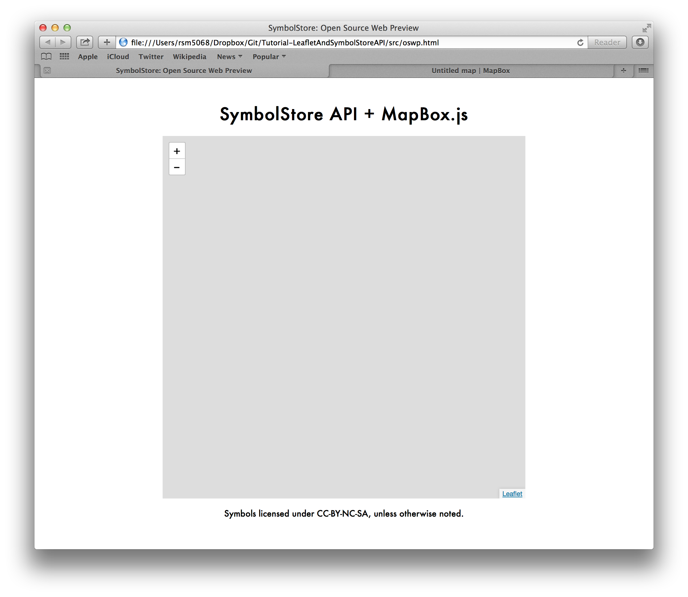

MapBox.js + SymbolStore API
============================

Ryan S Mullins    
GeoVISTA Center    
The Pennsylvania State University

# Background

The [SymbolStore][symstore] is an online repository of some 2300 symbols (and growing) that can be and are used to represent point features on maps, among other uses. As this repository has been presented at various conferences and in publications, some folks expressed an interest in a public API that would serve symbols to their applications. This API has now been actualized and is ready for public use.

This tutorial show how to use some features of the current [API][symstoreapiref] with [MapBox.js][mapboxjs] to create a simple map that uses custom point symbols avialable on the SymbolStore. I begin with an introduction to the SymbolStore API, and discussion of its methods and responses. Following this you will actually build a map using the API, MapBox.js, and (optionally) [TileMill][tilemill]. 

Of course, as with all development efforts, the SymbolStore API is constantly being refined and updated. I will do my best to update this tutorial as changes are made. But, if you notice I missed something please submit a bug, or (better still) fix it yourself and submit a pull request.

### Required Skills and Tools

There are several skills and tools that you will need to complete this tutorial. 

**Skils**

* Some experience with [HTML](http://en.wikipedia.org/wiki/Html)
* Some experience with [JavaScript](http://en.wikipedia.org/wiki/JavaScript)
* Some knowledge of [HTTP](http://en.wikipedia.org/wiki/Hypertext_Transfer_Protocol) requests and [RESTful APIs](http://en.wikipedia.org/wiki/RESTful)
* Experience with web maps (e.g. [Google Maps](http://maps.google.com) or [Open Street Map](http://osm.org))
* Some experience with the [Leaflet.js](http://leaflet.com) mapping library. 

**Tools** 

* A text editor &mdash; Everybody likes there own editor for [different reasons](http://xkcd.com/378/), so if you have a thing for `vim` or `emacs` or something else go right ahead and use it. If you have yet to find a text editor of your own, I suggest trying out [Sublime Text](www.sublimetext.com). 
* A browser &mdash; I like to use [Chrome](http://www.google.com/chrome), you may prefer [Firefox](http://www.mozilla.org/firefox) or [Safari](http://www.apple.com/safari/). All I ask is that you don't use Internet Explorer; I don't use it, I didn't test this on it, and I make no promises that any of this will work if you do.
* [Git][installgit] &mdash; A popular revision control system and the reason for GitHub, if you haven't installed it already now would be a good time.
* A [free MapBox account](http://www.mapbox.com/plans/) &mdash; MapBox are changing the game in web and mobile mapping, they provide hosting services and developed the [Leaflet.js](http://leafletjs.com/) plug-in used in this tutorial.
* A web server (optional) &mdash; You don't really need this for the tutorial I present here, but if you want to use an [Apache](http://httpd.apache.org/) or [nginx](http://wiki.nginx.org/Main) server during your development process it won't hurt. 
* [TileMill][tilemill] by MapBox (optional) &mdash; A simple editor for designing and publishing map tiles.


# The SymbolStore API

At present, the SymbolStore API has the functionality to search, serve, and package symbols for use in third party applications. Full documentation on the methods provided by the API can be found [here][symstoreapiref]. I want to focus on the search and serve methods of this API, and the response you can expect from requests to these methods.

Please note, all parameters for API methods are required unless otherwise noted.

## Search Method

The [SearchSymbols][symstoreapirefsearch] method provides the ability to search for symbols in the repository. Searches are conducted by querying the database of symbols based on a term, or series of terms, listed in the `serachTerm` parameter in the desired database fields. By default, the term(s) will be used to query against the name of the symbols, but this can be changed by defining a field or fields to query against using the `searchFields` parameter. Requests that leave the `serchTerm` parameter as an empty string will return all symbols in the repository, which can produce extremely long responses. To mitigate this long response problem the API paginates the response into pages of 25 symbols, the `page` parameter controls which page of results is returned in the response. You can also control the field by which symbols are ordered in the response using the `sortType` parameter. This method is fully documented below.

```Shell
Host:            http://symbolstore.org
Service:         /SymbolStoreRelease3REST/SymbolService.asmx
Method:          /SearchSymbols
Parameters:      searchTerms  - Terms to query for, i.e. 'fire', 'hospital', 'football'
                 searchFields - Fields to search for terms in (name, organization, tags, etc.)
                 sortType     - Order by which to sort results
                 page         - Page of results to return with request
                 format       - Deprecated
Request Type(s): GET, POST
```

## Serve Method

The [GetAllSymbols][symstoreapirefserve] method provides the ability to get the data associated with a specific list of symbols in the repository. By providing a list of unique identifiers to this method using the `symbolids` parameter you can specify the exact set of symbols that you would like to receive in the response. This response is not paginated. This method is fully documented below.

```Shell
Host:            http://symbolstore.org
Service:         /SymbolStoreRelease3REST/SymbolService.asmx
Method:          /GetAllContent
Parameters:      symbolids - Array of UIDs for symbols
                 format    - Deprecated
Request Type(s): GET, POST
```

## Standard Response

The search and serve methods both respond to requests using the standard JSON response format. The root of this response is a single JSON object which has three key members, `symbols`, `hitscount`, and `page`. The `symbols` member is an array of objects containing the metadata for the symbols returned in response to your request, including `id`, `name`, and `url`. The `hitscount` member tells you the total number of symbols in the repository that matched the query parameters you used in your request. The `page` member indicates the current page of results you are viewing in a paginated response (i.e. the response from the SearchSymbols method). The listing below gives the full documentation for the standard JSON response.

```Shell
{
    'searchterms': [String] Term(s) used to query the SymbolStore database
    'hitscount'  : [Number] Number of symbols associated with search term
    'numpages'   : [Number] Number of pages of symbols (25 symbols per page)
    'page'       : [Number] Index of the first page in the list of pages
    'searchfield': [String] Field(s) search term was used to query in database
    'message'    : [String] 'Success' or error message details
    'currentpage': [Number] Page viewed in this response
    'symbols'    : [
        {
            'id'                     : [Number] Unique ID of symbol in database
            'name'                   : [String] Name of symbol
            'url'                    : [String] URL to PNG image of symbol
            'keywords'               : [String] Comma separted list of keywords descibing this symbol
            'description'            : [String] Description of the symbol
            'tags'                   : [String] Comma separted list of tags categorizing this symbol
            'rating'                 : [Number] Rating of this symbol (not used)
            'uploadtime'             : [String] UNIX Epoch Time of upload into database
            'contributoremail'       : [String] Email address of website of contributor
            'contributorname'        : [String] Name of contributor
            'contributororganization': [String] Name of contributing organization
        },
        ...
    ]
}
```


# Integration with MapBox.js

Now it's time to make your own map using MapBox.js and the SymbolStore API. In this tutorial you will build a simple application that queries the SymbolStore for symbols related to a topic, then displays up to the first five results returned in the response on a map. The final app you will be making is shown below in Figure 1. 


There are some funny naming conventions in this tutorial, namely the use of the name 'oswp'. This tutorial was derived from work I did as part of the [Symbology](http://www.geovista.psu.edu/symbology/) project at the [GeoVISTA Center](http://www.geovista.psu.edu) at [Penn State](http://psu.edu). The goal of this work was to create an external web preview of how to use the SymbolStore API using open source tools. So, being the imaginative and original guy that I am, I chose to name that project the "Open Source Web Preview", leading me to use the abbreviation "oswp" in several file names.

## Step 0: Setup 

At this point you should have at least a text editor, a browser, and Git installed on your machine and have created an account with MapBox. If you do not have one or more of these items now would be a good time to install or sign-up for them.

The first step in this tutorial is cloning the tutorial to your machine, though I ask that you not push to master. Open a terminal or command prompt, navigate to a directory where you can work from (probably you Documents directory), and enter the following command.

```Shell
$ git clone https://github.com/RyanMullins/Tutorial-LeafletAndSymbolStoreAPI.git
```

This command will clone the project I have created onto your local machine. Inside the directory it creates you will find two files and three directories. The files are the license used on the code for this tutorial and the README file with the instructions you are currently reading. The 'src' directory contains the starter code for this tutorial; I provide a basic HTML page, a blank JavaScript file, and a CSS file to style things. The 'final' directory contains the completed, fully documented code for this tutorial, it is intended to be a reference for you as you work your way through this tutorial. The third directory, 'images', just has all the images used in figures during this tutorial an can be ignored.

Now, open the _oswp.html_ in your browser and take a look at what we have so far. It should look something like what is shown in Figure 2, a simple title and large blank space for the map, and a disclaimer abut the license for the symbols. 


You have the page where you will put the map, but right now you don't have the tiles that MapBox.js and Leaflet.js will use to actually show the map on the page. Log in to your MapBox account and you should be greeted with a page similar to the one shown in Figure 3. Create a new map using the streets preset, pan and zoom in on the Washington, D.C. area and set the center of the map in the settings panel (Figure 4.). You should also give your map a name. Save these changes 


### Optional: Using TileMill to Create Map Tiles

_Coming Soon_

## Step 1: Initializing a Base Map

So, you have a place to put a map and some tiles put in that place. Time to configure MapBox.js to put do the heavy lifting of making those tiles appear. 

Open the _oswp.js_ file from the _scripts_ directory in your text editor. The first thing we're going to do is create a couple of variables to keep track of the map and the symbols we add to the map. Copy and paste the code below into the _oswp.js_ file. 

```JavaScript
var map = null;         // The map used by this application
var markers = null;     // All markers currently on the map
```

On line 57 of the _oswp.html_ file you will see a call to the `init()` function. As you might expect, this function initializes the application once the page loads, instantiating a map and a Leaflet Lay Group to store the symbols you will be making in. The code for this function is listed below, copy and paste it into the _oswp.js_ file. 

```JavaScript
var init = function () {

    // ---- Map Initialization ----

    map = new L.map("map", {
        center: [38.895111, -77.036667],
        minZoom: 11,
        maxZoom: 16,
        zoom: 12
    });

    // ---- Map Data Layers and Groups ----

    var strTiles = new L.mapbox.tileLayer("AccountName.MapTileID")addTo(map);
    markers = new L.LayerGroup().addTo(map);
};
```

At this point, if you refresh the _oswp.html_ page in your browser you will see a big gray box and some zoom and pan controls where the blank space used to be (Figure 5). 



This happens because Leaflet has been told to initialize a map, but it doesn't have any tiles to put on top of it. If you look inside the `init()` function you will notice the declaration of variable named "strTiles", near the end of the function body. On this line you are using the MapBox.js tileLayer function to create a new tile layer and add it to the map. The problem is that I am using a dummy variable for the Map ID string in this code, instead of the actual map that MapBox uses to serve your map. Go to your MapBox account, look at the map tiles you made in Step 0 (saving any changes you have made along the way), and click the "Publish" button at the top of the tile editor page. You'll be presented with a pop-over dialog that has tabs for "Easy Embed", "MapBox.js", "Mobile", and "Static Image", click on the tab for "MapBox.js". You'll see a text box with the label "Map ID", copy the contents of that text box (Figure 6) and replace the content of the string that reads "AccountName.MapTileID" in the _oswp.js_ file with the content you copied from your MapBox account. Refresh the _oswp.html_ page in your browser and you should see a map with your tiles on the page (Figure 7). 


## Step 2: Querying the SymbolStore

Now you have a map with tiles on it, let's add some symbols from the SymbolStore. In this tutorial you are trying to create a map that let's you explore what kind of symbols are available on the symbol store for a given topic. Before you get to actually telling the SymbolStore the topic you are interested in, you should create a basic request to the `SearchSymbols` API method to make sure that you can connect to the SymbolStore.

You will be using [jQuery](http://jquery.com), a popular and very handy JavaScript front-end library, to request data from the SymbolStore. The code below show the getSymbols function. In this function you use the `ajax()` method of the jQuery library (represented as the variable `$`) to create an HTTP GET request to the SymbolStore API using the default parameters. You also tell the request to use the `processSymbols()` function to handle the response if it is successful (you haven't written this function yet, but will in the next step), and use an anonymous function that shows an alert on the screen if the request fails. Copy and paste this code into the _oswp.js_ file below the `init()` function.  

```JavaScript
var getSymbols = function (searchTerm) {
    $.ajax({
        'url' : "http://www.symbolstore.org/SymbolStoreRelease3REST/SymbolService.asmx/SearchSymbols",
        'data' : {
            'searchTerms' : ((searchTerm && searchTerm.length > 0) ? searchTerm : ""),
            'searchField' : "",
            'sortType'    : "",
            'page'        : 1,
            'format'      : ""
        },
        'dataType' : 'json',
        'type' : 'GET',
        'success' : processSymbols,
        'error' : function () {
            alert("AJAX request to SymbolStore API failed.")
        }
    });
};
```

At it stands right now, the `getSymbols()` function is never called. Add the following line at the bottom of the body of the `init()` function. This will then call the `getSymbols()` function when the application is initialized.

```JavaScript
getSymbols();
```

Refresh the _oswp.html_ page in your browser. If everything is working properly you shouldn't see anything more than what you saw before (see Figure 7), but it's possible that a pop-up alert will show up saying that the request failed. This is most likely due to a bad connection to the API or that the API is down. Try again and if the problem persists contact the [SymbolStore team](mailto:symbolstore@psu.edu) or submit a bug report.

## Step 3: Processing the SymbolStore Response

Time for another status check. You should have a map, with tiles, on a web page that's also requesting symbols from the SymbolStore API. Not bad. Now you can add symbols to the map. 

As I mentioned before, if the request to the SymbolStore API is successful the `processSymbols()` function is called and passed the data returned from the request to act upon. The code below declares the `processSymbols()` function, copy and paste this into the _oswp.js_ file. 

```JavaScript
var processSymbols = function (symbolData) {

    // Clear any existing symbols from the map

    if (markers) {
        markers.clearLayers();
    }

    // Check that the query returned data, if not log it and return

    if (!symbolData) { 
        console.log("No data returned from request"); 
        return;
    }

    if (symbolData.hitscount < 1) {
        console.log("No symbols returned for request");
        return;
    }

    // Some static locations to place symbols at on the map

    var positions = [
        [38.8945036, -77.0355398],
        [38.8991629, -77.0425136],
        [38.9088221, -77.0272914],
        [38.9135349, -77.0393075],
        [38.9169409, -77.0547570]
    ];

    // Calculating the number of symbols to add to the map

    var numSymbols = (symbolData.hitscount < positions.length ? 
        symbolData.hitscount : positions.length);

    // Looping through the symbols returned in the response

    for (var i = 0; i < numSymbols; i++) {
        var symbol = symbolData.symbols[i];

        // Creating a new Leaflet Marker to add to the LayerGroup
        // Includes creating a custom Leaflet Icon for the marker using the symbol's URL

        var marker = new L.Marker(
            positions[i],
            {
                icon: new L.Icon({
                    iconUrl: symbol.url,
                    iconSize: [20,20]
                }),
                title: symbol.name
            }
        );

        // Creating a pop-up with the metadata for this symbol

        var popup = new L.Popup();
        popup.setContent(
            "<b>" + symbol.name + "</b><br/>" +
            "Description &ndash; " + symbol.description + "<br/>" +
            "Contributed by: " + symbol.contributorname + 
            ((symbol.contributororganization && symbol.contributororganization.length >0) ? 
                "(" + symbol.contributororganization + ")" : "")
        );

        // Binding the pop-up to the marker and adding the marker to the marker group

        marker.bindPopup(popup);
        markers.addLayer(marker);
    }
};
```

As you can see, there is a lot going on in this function. 

The process starts by clearing off any existing symbols on the map (which will be our visual indicator that the request was successfully sent) using the Leaflet Layer Group's `clearLayers()` function. Next there is some error checking to make sure that the data from the response actually exists, and the make sure that there were symbols in the database that matched the query parameters. 

Then comes the process of actually taking this response and turning it into markers on the map. I have provided some points, stored in the positions array, to use as location for the various Leaflet Markers you will create. Next the code loops through the list of symbols provided in the response from the SymbolStore, stopping when it hits either the end of the list of symbols or runs out of positions to place those symbols at on the map. For each iteration in the loop, the code creates a new [Marker](http://leafletjs.com/reference.html#marker) for that symbol at a location, creates a custom [Icon](http://leafletjs.com/reference.html#icon) for that Marker using the URI provided in the response, and binds a [Popup](http://leafletjs.com/reference.html#popup) to that Marker that contains some metadata for that symbol. Each Marker is then added to the `makers` Layer Group, which in turn tells Leaflet to display that Marker on the map. 


Refresh the _oswp.html_ file in your browser. You should see a five symbols displayed on top of your map (Figure 8). 

## Step 4: Adding a Query Field

Home stretch, time to add the ability to query the SymbolStore for symbols based on a topic. This requires two things, adding a text field and button to the page, and adding some code to make it trigger a query to the SymbolStore. 

Starting with the UI components, the markup below should be copied and pasted into the _oswp.html_ file above the 'div' element for the map and below the 'div' element. This will place a text field and and button atop your map that we'll use some jQuery on to make functional.

```HTML
<div id="search">
    <input type="text" id="searchfield" />
    <button type="button" id="searchbutton">Search</button>
</div>
```

The code below should be copied and pasted into the _oswp.js_ file inside the body of the `init()` function and before the call to `getSymbols()` (though you could put it after this call, it's your decision). This code does a couple things. First, it uses jQuery to set up a 'keypress' listener on the text input field. When the user types in this, the code checks to see if that keystroke as the 'enter' key (key code 13) and if so calls the `getSymbols()` function passing the content of the text field as a parameter that is used as a search term in the `SearchSymbols` request. Second, it again uses jQuery to add a 'click' handler to the button. Now, when a user click on this button the application will 

```JavaScript
// ---- jQuery for UI Elements ----

// Set text input to query the SymbolStore API when user presses 'enter'

$("#searchfield").on('keypress', function (e) {
    if (e.keyCode == 13)  { 
        getSymbols($("#searchfield").val());
        return false;
    }
});

// Set button to query SymbolStore API on click

$("#searchbutton").on('click', function () {
    getSymbols($("#searchfield").val());
});
```

One last time, refresh the _oswp.html_ page in your browser. It should look something like Figure 9, and when you type in a search term (try 'fire') the symbols should change. If it does, then you're done! If not, then try to debug it and use the complete version I include with this tutorial to check against. If your issues persist please file a bug report as I may have an error. 


For a more full-featured example application I invite you to look at the example that I have on my [PSU Personal Webspace](http://personal.psu.edu/rsm5068/SSMB/oswp.html). This example allows you to change tile layers as well as query the SymbolStore API. 

Thanks for following along with this tutorial. I look forward to seeing what kind of apps are made using the SymbolStore API, please let me know of any you create by tweeting me [@RyanMullins](http://twitter.com/RyanMullins). 


_**Disclaimer**_

_This material is based upon work supported by the U.S. Department of Homeland Security. Any opinions, findings, conclusions or recommendations expressed in this material are those of the author(s) and do not necessarily reflect the views of funding agencies._

<!-- Hyperlinks -->

[installgit]: https://help.github.com/articles/set-up-git
[mapboxjs]: http://www.mapbox.com/mapbox.js/api/v1.3.1/
[symstore]: http://symbolstore.org
[symstoreapiref]: http://www.symbolstore.org/SymbolStoreRelease3REST/SymbolService.asmx
[symstoreapirefsearch]: http://www.symbolstore.org/SymbolStoreRelease3REST/SymbolService.asmx?op=SearchSymbols
[symstoreapirefserve]: http://www.symbolstore.org/SymbolStoreRelease3REST/SymbolService.asmx?op=GetAllContent
[tilemill]: http://www.mapbox.com/tilemill/
